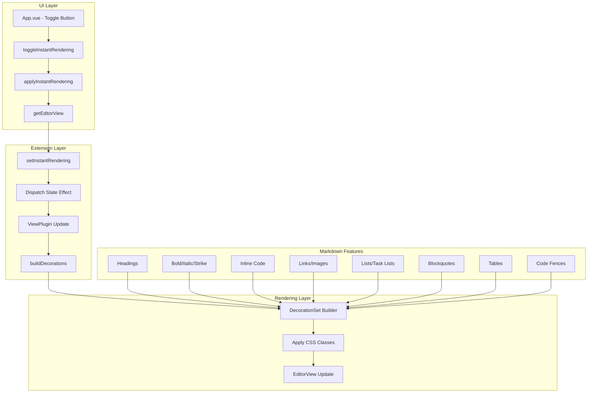

# Instant Rendering (IR) Implementation Plan

## Overview

This plan outlines the steps to implement a Typora-like instant rendering (IR) feature for the md-editor-v3 based Markdown editor. The IR feature hides Markdown syntax while editing, showing the rendered output directly in the editor.

## Current State Analysis

### Files Involved
- [`webview/src/main.ts`](../webview/src/main.ts) - Extension registration point
- [`webview/src/App.vue`](../webview/src/App.vue) - UI toggle and integration
- [`webview/src/ir/instantRendering.ts`](../webview/src/ir/instantRendering.ts) - IR extension implementation
- [`webview/src/styles.css`](../webview/src/styles.css) - CSS styles for IR decorations

### Identified Issues

1. **Extension Registration**: The extension is registered via `codeMirrorExtensions` config but may not be properly integrated with the editor's state
2. **Timing**: The `applyInstantRendering()` function is called in `onMounted`, but the editor might not be fully initialized
3. **State Field Access**: The `instantRenderingState` field might not be accessible in the editor's state
4. **No Console Errors**: The code runs without errors, suggesting the issue is in how the extension is wired up

## Architecture



## Implementation Steps

### Step 1: Fix Extension Registration in main.ts

**Problem**: The extension is registered but may not be properly added to the editor's state.

**Solution**: 
- Ensure the extension is properly returned from the `codeMirrorExtensions` function
- Verify the extension format matches md-editor-v3's expectations (type + extension)

**Changes to [`webview/src/main.ts`](../webview/src/main.ts)**:
```typescript
// Current implementation:
codeMirrorExtensions: extensions => {
  const next = [...extensions];
  next.push({
    type: 'instant-rendering',
    extension: registerInstantRendering()
  });
  return next;
}

// The extension needs to be a proper CodeMirror Extension array
```

### Step 2: Fix instantRendering.ts Extension Structure

**Problem**: The extension structure may not be compatible with md-editor-v3's extension system.

**Solution**:
- Ensure `instantRenderingExtension()` returns a proper Extension array
- Add proper compartment support for dynamic updates
- Fix the ViewPlugin to properly access the state field

**Changes to [`webview/src/ir/instantRendering.ts`](../webview/src/ir/instantRendering.ts)**:
1. Fix the extension export to return a proper Extension
2. Add compartment support for toggling IR mode
3. Ensure the state field is properly accessible

### Step 3: Add Proper Error Handling and Debug Logging

**Solution**:
- Add console logging to track extension initialization
- Add error handling for `getEditorView()` returning undefined
- Add debug mode to inspect decorations

### Step 4: Test Basic IR Functionality

**Features to test**:
- Headings (H1-H6)
- Bold (**text**)
- Italic (*text*)
- Strikethrough (~~text~~)
- Inline code (`code`)

### Step 5: Add Support for Lists, Task Lists, and Blockquotes

**Features to implement**:
- Unordered lists (-, *, +)
- Ordered lists (1., 2., etc.)
- Task lists (- [ ], - [x])
- Blockquotes (>)

### Step 6: Add Support for Links and Images

**Features to implement**:
- Links: [text](url)
- Images: 
- Reference links and images

### Step 7: Add Support for Tables and Code Fences

**Features to implement**:
- Tables (with proper column alignment)
- Code fences (```lang```)
- Math blocks ($$...$$)

### Step 8: Add Input Handlers

**Features to implement**:
- Enter key handling for list continuation
- Backspace handling for removing list markers
- Checkbox toggling (space key)
- Heading level adjustment

### Step 9: Add Fallback/Escape Hatch

**Features to implement**:
- "Edit source here" button for specific regions
- Quick toggle back to source mode
- Raw markdown editing for complex cases

### Step 10: Update Documentation

**Documentation to add**:
- Feature matrix in README.md
- Usage instructions
- Known limitations
- Keyboard shortcuts

## Detailed Implementation Notes

### Extension Registration Pattern

The md-editor-v3 `codeMirrorExtensions` function receives:
- `extensions`: Array of existing CodeMirrorExtension objects
- `options`: Object with `editorId`, `theme`, and `keyBindings`

Each CodeMirrorExtension should have:
- `type`: String identifier for the extension
- `extension`: The actual CodeMirror Extension or function returning one
- `compartment`: Optional Compartment for dynamic updates
- `options`: Optional options object

### State Field Pattern

The state field needs to be:
1. Defined with `StateField.define()`
2. Included in the extension array
3. Accessible via `view.state.field(fieldName)`

### Decoration Pattern

Decorations are built using:
1. `RangeSetBuilder` to create the decoration set
2. `Decoration.mark()` for inline decorations
3. `Decoration.line()` for line decorations
4. `Decoration.widget()` for custom widgets

### CSS Class Pattern

CSS classes should follow the pattern:
- `.ir-*` for IR-specific classes
- `.cm-content .ir-*` to target editor content
- `.cm-line.ir-*` for line-level decorations

## Testing Strategy

1. **Unit Tests**: Test individual decoration builders
2. **Integration Tests**: Test the extension with md-editor-v3
3. **Manual Tests**: Test with real Markdown documents
4. **Performance Tests**: Test with large documents

## Known Limitations

1. Nested Markdown constructs may have rendering issues
2. Complex tables may not render correctly
3. Math rendering depends on KaTeX integration
4. Mermaid diagrams cannot be rendered inline

## Future Enhancements

1. Syntax highlighting for code blocks in IR mode
2. Live preview of links and images
3. Collapsible sections for long documents
4. Custom theme support for IR mode
5. Export IR mode as HTML
