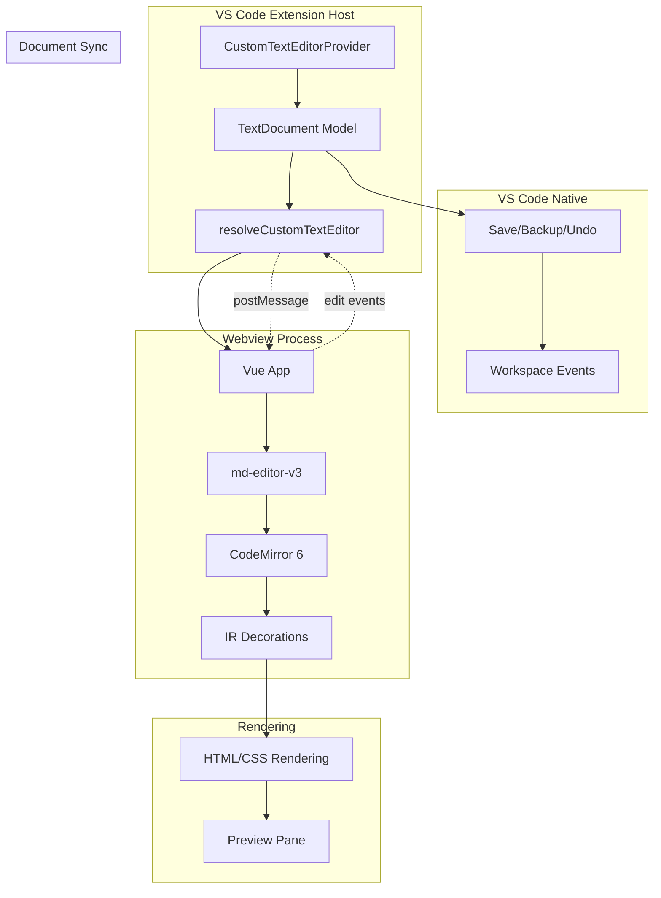
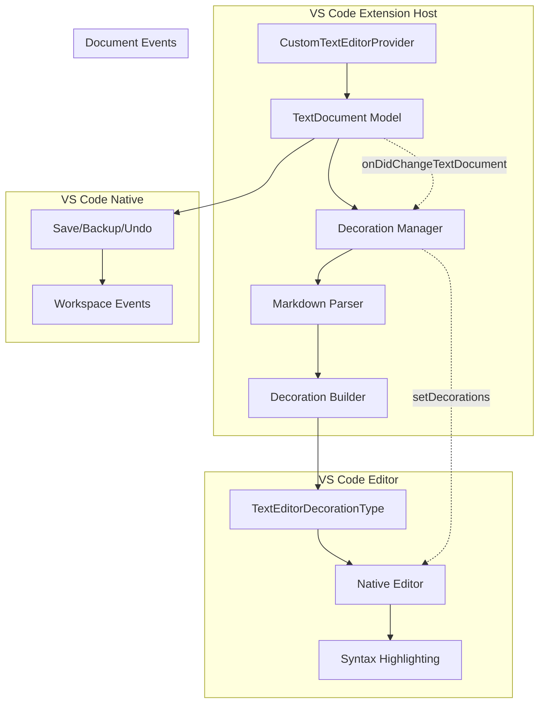
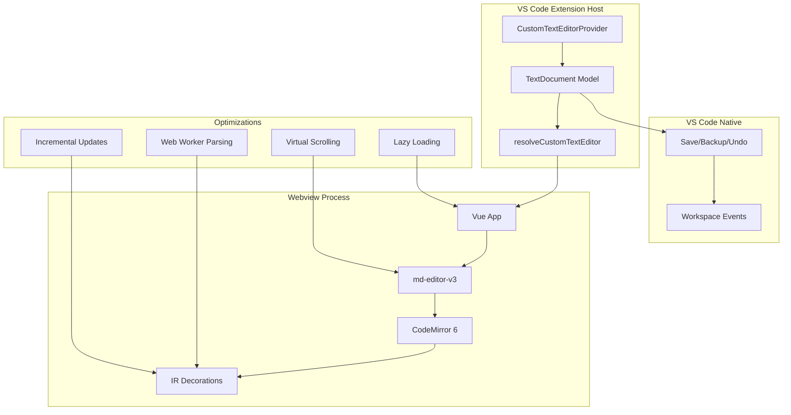
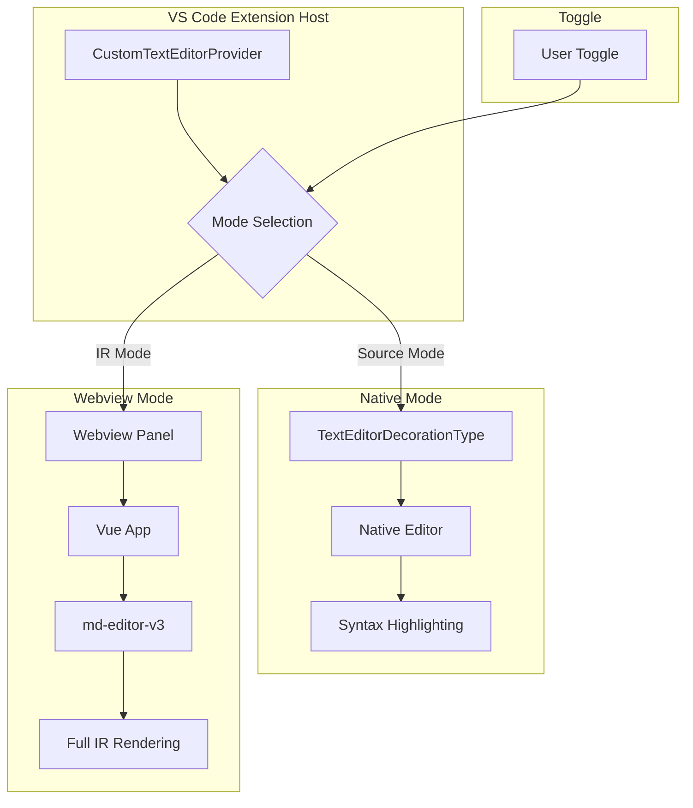

# Viability Evaluation: Typora-like Markdown Editor with VS Code Native Rendering

## Executive Summary

This document evaluates the viability of building a Typora-like markdown editor using VS Code's native [`TextEditorDecorationType`](https://code.visualstudio.com/api/references/vscode-api#TextEditorDecorationType) API instead of webview-based rendering. The evaluation considers technical feasibility, performance implications, feature completeness, and implementation complexity.

**Current Architecture**: Your project uses [`CustomTextEditorProvider`](../src/extension.ts:38) which leverages VS Code's native [`TextDocument`](https://code.visualstudio.com/api/references/vscode-api#TextDocument) model. This is a well-designed approach that:
- Lets VS Code handle document state, saves, backups, and undo/redo
- Uses the webview purely as a rendering layer
- Provides a clean separation between model and view

**Conclusion**: Building a Typora-like markdown editor using VS Code's native [`TextEditorDecorationType`](https://code.visualstudio.com/api/references/vscode-api#TextEditorDecorationType) API is **technically feasible but has significant limitations**. While it offers better performance than webview, it cannot achieve the same level of visual polish and feature completeness as Typora or webview-based solutions.

**Key Insight**: Since you already use [`CustomTextEditorProvider`](../src/extension.ts:38), you have **two viable paths**:
1. **Optimize existing webview** - Fix the extension registration and leverage your existing IR implementation
2. **Add native decorations mode** - Create a toggle to use native [`TextEditorDecorationType`](https://code.visualstudio.com/api/references/vscode-api#TextEditorDecorationType) for basic styling

---

## 1. Technical Approaches Comparison

### 1.1 Current Approach: CustomTextEditorProvider with Webview

**Architecture:**


**Pros:**
- **VS Code manages document state** - saves, backups, undo/redo are automatic
- Full control over rendering via HTML/CSS
- Can use existing markdown libraries (md-editor-v3, KaTeX, Mermaid)
- Rich UI components possible
- Existing instant rendering implementation in [`webview/src/ir/instantRendering.ts`](../webview/src/ir/instantRendering.ts:1)
- Clean separation between model (VS Code) and view (webview)

**Cons:**
- Performance overhead from webview process
- Higher memory usage
- Slower startup time
- Limited integration with VS Code native features

### 1.2 Proposed Approach: Native TextEditorDecorationType

**Architecture:**


**Pros:**
- Native performance (no webview overhead)
- Lower memory usage
- Faster startup
- Better integration with VS Code features (minimap, find, etc.)
- Can work alongside existing [`CustomTextEditorProvider`](../src/extension.ts:38)
- Reuses VS Code's document model

**Cons:**
- Limited styling capabilities
- Cannot render complex elements (tables, math, diagrams)
- No support for custom widgets
- Limited to text decorations only
- Would require switching between webview and native editor

---

## 2. VS Code TextEditorDecorationType Capabilities

### 2.1 Available Decoration Options

Based on VS Code API research, [`TextEditorDecorationType`](https://code.visualstudio.com/api/references/vscode-api#TextEditorDecorationType) supports:

| Feature | Capability | IR Relevance |
|---------|-----------|--------------|
| Text color | ✅ Full control | Medium |
| Background color | ✅ Full control | High |
| Opacity | ✅ Supported (via `Diagnostic.Unnecessary`) | High |
| Border | ✅ Full control | Low |
| Text decorations (underline, strikethrough) | ✅ Full control | Medium |
| Font weight/style | ✅ Full control | Medium |
| Before/after content | ✅ Text and icons | Low |
| Overview ruler | ✅ Full control | None |
| Minimap | ✅ Full control | None |

### 2.2 Critical Limitations for Instant Rendering

**Cannot Hide Text Completely:**
- VS Code decorations can only style text, not hide it
- Opacity can be reduced but not to 0 (text remains selectable)
- No way to replace markdown syntax with rendered output

**No Custom Widgets:**
- Cannot render checkboxes, images, or interactive elements
- Cannot embed HTML or custom components
- Limited to text-based decorations only

**Limited Layout Control:**
- Cannot change line height or spacing
- Cannot add padding or margins
- Cannot create custom block layouts

**No Support For:**
- Tables (require complex layout)
- Math rendering (KaTeX)
- Diagrams (Mermaid)
- Image previews
- Code block syntax highlighting

---

## 3. Feature-by-Feature Viability Analysis

### 3.1 Inline Formatting

| Feature | Webview | Native Decorations | Viability |
|---------|---------|-------------------|-----------|
| Bold (`**text**`) | ✅ Hide syntax, style content | ⚠️ Can style but cannot hide syntax | **Partial** |
| Italic (`*text*`) | ✅ Hide syntax, style content | ⚠️ Can style but cannot hide syntax | **Partial** |
| Strikethrough (`~~text~~`) | ✅ Hide syntax, style content | ✅ Can style with `textDecoration` | **Good** |
| Inline code (`` `code` ``) | ✅ Hide syntax, style content | ✅ Can style with background | **Good** |
| Links (`[text](url)`) | ✅ Hide URL, style text | ⚠️ Can style but cannot hide URL | **Partial** |

### 3.2 Block Elements

| Feature | Webview | Native Decorations | Viability |
|---------|---------|-------------------|-----------|
| Headings (`# Text`) | ✅ Hide `#`, style as heading | ⚠️ Can style but cannot hide `#` | **Partial** |
| Blockquotes (`> Text`) | ✅ Hide `>`, style as quote | ⚠️ Can style but cannot hide `>` | **Partial** |
| Code fences | ✅ Hide backticks, syntax highlight | ⚠️ Can style but cannot hide fences | **Partial** |
| Horizontal rules | ✅ Render as line | ❌ Cannot render custom elements | **Not Viable** |

### 3.3 Lists

| Feature | Webview | Native Decorations | Viability |
|---------|---------|-------------------|-----------|
| Unordered lists (`- item`) | ✅ Hide marker, custom bullet | ⚠️ Can style but cannot hide marker | **Partial** |
| Ordered lists (`1. item`) | ✅ Hide marker, custom numbering | ⚠️ Can style but cannot hide marker | **Partial** |
| Task lists (`- [ ]`) | ✅ Custom checkbox widget | ❌ Cannot render custom widgets | **Not Viable** |

### 3.4 Complex Elements

| Feature | Webview | Native Decorations | Viability |
|---------|---------|-------------------|-----------|
| Tables | ✅ Full rendering with borders | ❌ Cannot render table layout | **Not Viable** |
| Images | ✅ Render actual images | ❌ Cannot render images | **Not Viable** |
| Math (KaTeX) | ✅ Full math rendering | ❌ Cannot render math | **Not Viable** |
| Diagrams (Mermaid) | ✅ Full diagram rendering | ❌ Cannot render diagrams | **Not Viable** |

---

## 4. Performance Comparison

### 4.1 Webview Approach

| Metric | Typical Value |
|--------|---------------|
| Startup time | 200-500ms |
| Memory overhead | 50-100MB |
| Rendering latency | 10-50ms |
| Large file handling | May degrade with >10k lines |

### 4.2 Native Decorations Approach

| Metric | Expected Value |
|--------|----------------|
| Startup time | <50ms |
| Memory overhead | 5-10MB |
| Rendering latency | <10ms |
| Large file handling | Scales linearly with document size |

**Performance Advantage**: Native decorations offer **4-10x better performance** for startup and rendering.

---

## 5. Implementation Complexity

### 5.1 Webview Approach (Current)

**Existing Implementation:**
- [`webview/src/ir/instantRendering.ts`](../webview/src/ir/instantRendering.ts:1) - 591 lines
- Decoration builder with regex patterns
- Custom widgets (checkboxes)
- Key handlers for lists

**Remaining Work:**
- Fix extension registration in [`webview/src/main.ts`](../webview/src/main.ts:19-28)
- Add CSS styles for decorations
- Test and refine

### 5.2 Native Decorations Approach

**Required Implementation:**
```
1. Markdown Parser (new)
   - Parse entire document
   - Build AST with positions
   - Track all markdown constructs

2. Decoration Manager (new)
   - Create TextEditorDecorationType instances
   - Map AST positions to decorations
   - Handle document changes efficiently

3. State Management (new)
   - Track decoration state
   - Handle toggle on/off
   - Persist user preferences

4. Input Handlers (new)
   - Intercept typing
   - Auto-continue lists
   - Toggle checkboxes (limited)
   - Handle heading shortcuts

5. Performance Optimization (new)
   - Debounce decoration updates
   - Only update visible range
   - Cache decoration sets
```

**Estimated Complexity**: 2-3x more complex than webview approach

---

## 6. Recommended Approach

### 6.1 Optimize Existing CustomTextEditorProvider (Recommended)

Since you already use [`CustomTextEditorProvider`](../src/extension.ts:38), the most practical approach is to optimize the existing webview implementation:



**Benefits:**
- Leverages existing implementation in [`webview/src/ir/instantRendering.ts`](../webview/src/ir/instantRendering.ts:1)
- VS Code manages document state automatically
- Only need to fix extension registration and add optimizations
- Full feature support (tables, math, diagrams)
- Clean architecture with model-view separation

### 6.2 Hybrid Solution (Alternative)

Combine native and webview approaches:



**Benefits:**
- Native mode for fast, simple editing
- Webview mode for full IR experience
- User can choose based on needs
- Leverages existing webview implementation

**Challenges:**
- Requires switching between native editor and webview
- More complex state management
- User experience may be jarring when switching modes

---

## 7. Decision Matrix

| Criteria | Webview | Native | Hybrid | Winner |
|----------|---------|--------|--------|--------|
| Performance | Medium | High | Medium-High | Native |
| Feature Completeness | High | Low | High | Webview |
| Implementation Effort | Low (existing) | High | Medium | Webview |
| User Experience | High | Medium | Medium | Webview |
| Maintainability | Medium | High | Medium | Native |
| VS Code Integration | Medium | High | Medium | Native |

**Overall Recommendation**: **Optimize Existing Webview** (Option B)

---

## 8. Next Steps

### Option A: Optimize Existing Webview (Recommended)

1. Fix extension registration in [`webview/src/main.ts`](../webview/src/main.ts:19-28)
2. Add CSS styles for IR decorations
3. Implement performance optimizations
4. Test and refine

### Option B: Hybrid Approach

1. Keep existing webview implementation
2. Add native decorations mode
3. Implement toggle between modes
4. Handle state synchronization

### Option C: Native Decorations Only

1. Build markdown parser from scratch
2. Implement decoration manager
3. Create input handlers
4. Accept feature limitations

---

## 9. Conclusion

### Summary of Findings

Building a Typora-like markdown editor using VS Code's native [`TextEditorDecorationType`](https://code.visualstudio.com/api/references/vscode-api#TextEditorDecorationType) API is **technically feasible but not recommended** as a standalone solution due to:

1. **Critical Feature Gaps**: Cannot hide syntax, render tables, images, math, or diagrams
2. **Limited Styling**: Cannot achieve Typora's visual polish
3. **High Complexity**: Requires building custom parser and decoration system
4. **User Experience**: Would feel incomplete compared to Typora

### Key Architectural Insight

Your current use of [`CustomTextEditorProvider`](../src/extension.ts:38) is well-designed because:
- VS Code handles document state, saves, backups, and undo/redo automatically
- The webview is purely a rendering layer, not a document model
- This provides a clean separation of concerns

### Recommended Path

**Option A: Optimize Existing Webview** (Recommended)

This is the most practical approach because:
1. Your IR implementation in [`webview/src/ir/instantRendering.ts`](../webview/src/ir/instantRendering.ts:1) is well-structured
2. The main issue is extension registration in [`webview/src/main.ts`](../webview/src/main.ts:19-28)
3. You get full feature support (tables, math, diagrams)
4. Performance can be improved with optimizations

**Option B: Hybrid Approach**

If you want the performance benefits of native editing:
1. Keep webview for full IR mode
2. Add native decorations mode for basic styling
3. Implement toggle between modes
4. Accept the UX trade-offs of switching modes

### Final Recommendation

**Start with Option A** (optimize existing webview) because:
- Minimal effort to get working (fix extension registration)
- Full feature support from day one
- Performance can be optimized incrementally
- Your existing architecture is solid

If performance becomes a concern, consider Option B (hybrid) as an enhancement.
