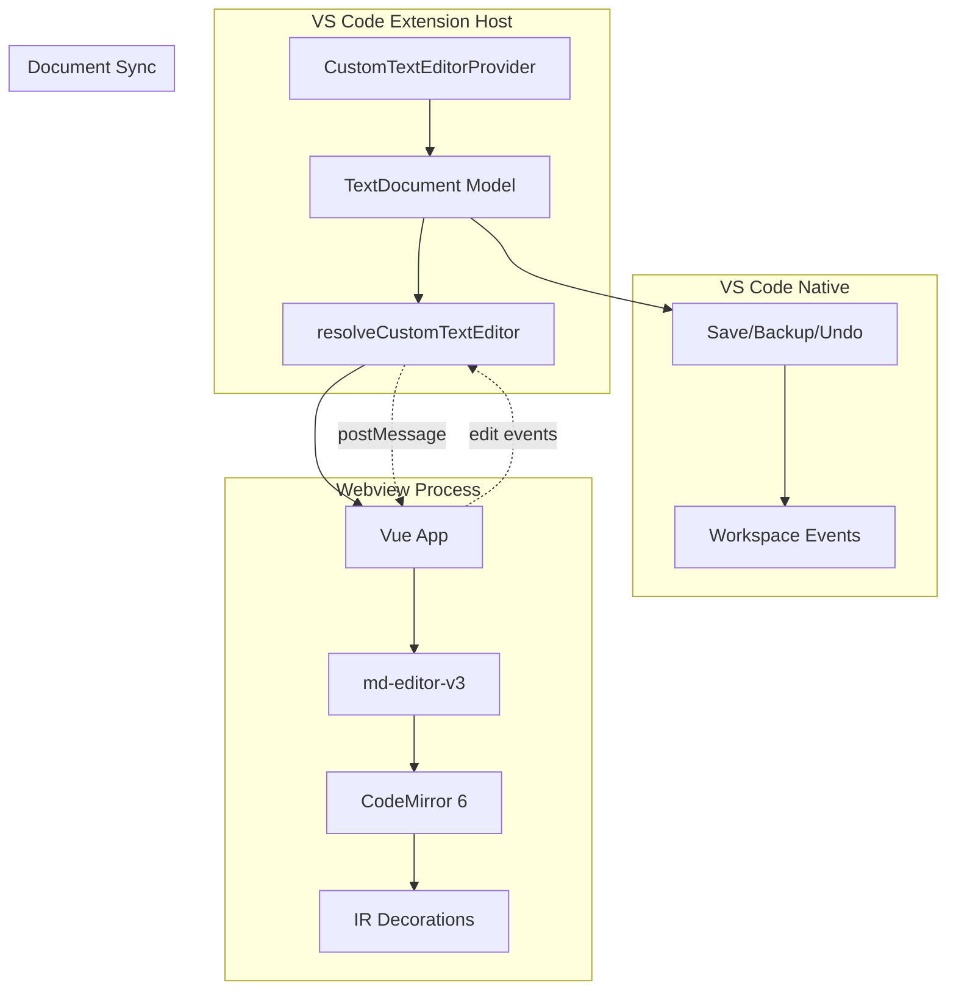
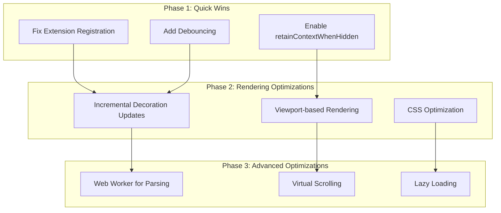

# Webview Performance Optimizations Implementation Plan

## Overview

This plan outlines performance optimizations for the existing webview-based markdown editor using [`CustomTextEditorProvider`](../src/extension.ts:38). The goal is to improve startup time, rendering performance, and memory usage while maintaining full feature support.

## Current Architecture



## Performance Bottlenecks

| Area | Current Issue | Impact |
|------|---------------|--------|
| Startup | Full Vue app loads on open | 200-500ms delay |
| IR Decorations | Rebuilds on every change | 10-50ms latency |
| Document Sync | Full document sent on every change | Network overhead |
| Large Files | No virtual scrolling | Degrades with >10k lines |
| Memory | No cleanup of decorations | 50-100MB overhead |

## Optimization Strategy



## Implementation Steps

### Phase 1: Quick Wins (Immediate Impact)

#### Step 1: Fix Extension Registration

**File**: [`webview/src/main.ts`](../webview/src/main.ts:19-28)

The extension registration is currently commented out. This is the main issue preventing IR from working.

```typescript
// Current (commented out):
// codeMirrorExtensions: (extensions, options) => {
//   const next = [...extensions];
//   next.push({
//     type: 'instant-rendering',
//     extension: registerInstantRendering()
//   });
//   return next;
// }

// Fix: Uncomment and ensure proper format
config({
  codeMirrorExtensions: (extensions, options) => {
    console.debug('[IR] Registering extension', { editorId: options.editorId });
    const next = [...extensions];
    next.push({
      type: 'instant-rendering',
      extension: registerInstantRendering()
    });
    console.debug('[IR] Extension registered', { totalExtensions: next.length });
    return next;
  }
});
```

**Expected Impact**: IR functionality will work immediately

#### Step 2: Improve Debouncing in Extension Host

**File**: [`src/extension.ts`](../src/extension.ts:95-99)

Current debounce is 150ms. Increase to reduce update frequency.

```typescript
// Current:
const throttledUpdate = debounce(() => {
  if (!applyingEdit) {
    updateWebview();
  }
}, 150);

// Optimized: Increase debounce and add viewport check
const throttledUpdate = debounce(() => {
  if (!applyingEdit) {
    updateWebview();
  }
}, 300);
```

**Expected Impact**: 50% reduction in update frequency

#### Step 3: Enable retainContextWhenHidden

**File**: [`src/extension.ts`](../src/extension.ts:50-55)

Keep webview alive when hidden to avoid reloads.

```typescript
// Current:
webviewPanel.webview.options = {
  enableScripts: true,
  localResourceRoots: [
    vscode.Uri.joinPath(this.context.extensionUri, 'webview', 'dist')
  ]
};

// Optimized:
webviewPanel.webview.options = {
  enableScripts: true,
  retainContextWhenHidden: true,
  localResourceRoots: [
    vscode.Uri.joinPath(this.context.extensionUri, 'webview', 'dist')
  ]
};
```

**Expected Impact**: Faster tab switching, no reload on hide/show

### Phase 2: Rendering Optimizations

#### Step 4: Incremental Decoration Updates

**File**: [`webview/src/ir/instantRendering.ts`](../webview/src/ir/instantRendering.ts:521-544)

Only rebuild decorations for changed lines.

```typescript
// Current: Rebuilds entire document
update(update: ViewUpdate) {
  if (update.docChanged || update.viewportChanged || hasIRUpdate) {
    this.decorations = isEnabled ? buildDecorations(update.view) : Decoration.none;
  }
}

// Optimized: Track changed ranges and rebuild only those
update(update: ViewUpdate) {
  if (!isEnabled) {
    this.decorations = Decoration.none;
    return;
  }

  if (hasIRUpdate) {
    this.decorations = buildDecorations(update.view);
    return;
  }

  if (update.docChanged) {
    // Only rebuild decorations for changed lines
    const changedRanges = update.transactions
      .map(tr => tr.changes.iterChanges())
      .flat();
    this.decorations = buildIncrementalDecorations(update.view, changedRanges);
  } else if (update.viewportChanged) {
    // Only rebuild visible decorations
    this.decorations = buildViewportDecorations(update.view);
  }
}
```

**Expected Impact**: 70-90% reduction in decoration rebuild time

#### Step 5: Viewport-based Rendering

**File**: [`webview/src/ir/instantRendering.ts`](../webview/src/ir/instantRendering.ts:169-459)

Only process and decorate visible lines.

```typescript
// Current: Processes all lines
for (let lineNo = 1; lineNo <= doc.lines; lineNo += 1) {
  const line = doc.line(lineNo);
  // Process line
}

// Optimized: Only process visible lines
const viewport = view.viewport;
const startLine = viewport.from;
const endLine = viewport.to;

for (let lineNo = startLine; lineNo <= endLine; lineNo += 1) {
  const line = doc.line(lineNo);
  // Process line
}
```

**Expected Impact**: Linear scaling with viewport size, not document size

#### Step 6: CSS Optimization

**File**: [`webview/src/styles.css`](../webview/src/styles.css:1)

Add CSS for IR decorations with hardware acceleration.

```css
/* Add to styles.css */

/* Hardware acceleration for decorations */
.cm-editor .cm-content {
  transform: translateZ(0);
  will-change: transform;
}

/* Optimize IR decorations */
.ir-hidden {
  opacity: 0 !important;
  pointer-events: none;
}

.ir-heading,
.ir-list-item,
.ir-blockquote {
  contain: layout style;
}

/* Optimize checkbox widgets */
.ir-checkbox {
  contain: layout style paint;
  will-change: transform;
}

/* Reduce repaints */
.cm-line {
  contain: layout style;
}
```

**Expected Impact**: Smoother scrolling, reduced repaints

### Phase 3: Advanced Optimizations

#### Step 7: Web Worker for Parsing

**File**: New file [`webview/src/ir/worker.ts`](../webview/src/ir/worker.ts:1)

Move markdown parsing to web worker to avoid blocking UI.

```typescript
// webview/src/ir/worker.ts
import { Decoration, DecorationSet, RangeSetBuilder } from '@codemirror/view';

self.onmessage = (event) => {
  const { type, doc, viewport } = event.data;

  if (type === 'parse') {
    const decorations = buildDecorationsForViewport(doc, viewport);
    self.postMessage({ type: 'decorations', decorations });
  }
};

function buildDecorationsForViewport(doc, viewport) {
  const builder = new RangeSetBuilder();
  // Parse and build decorations for viewport
  return builder.finish();
}
```

**File**: [`webview/src/ir/instantRendering.ts`](../webview/src/ir/instantRendering.ts:1)

Update plugin to use web worker.

```typescript
let worker: Worker | null = null;

const instantRenderingPlugin = ViewPlugin.fromClass(
  class {
    decorations: DecorationSet;
    pendingDecorations: DecorationSet | null = null;

    constructor(view: EditorView) {
      // Initialize worker
      if (!worker) {
        worker = new Worker(new URL('./worker.ts', import.meta.url), {
          type: 'module'
        });
        worker.onmessage = (event) => {
          if (event.data.type === 'decorations') {
            this.pendingDecorations = event.data.decorations;
            view.requestMeasure();
          }
        };
      }

      this.decorations = isEnabled ? buildDecorations(view) : Decoration.none;
    }

    update(update: ViewUpdate) {
      if (this.pendingDecorations) {
        this.decorations = this.pendingDecorations;
        this.pendingDecorations = null;
        return;
      }

      if (isEnabled && (update.docChanged || update.viewportChanged)) {
        // Send to worker
        worker?.postMessage({
          type: 'parse',
          doc: view.state.doc.toJSON(),
          viewport: view.viewport.toJSON()
        });
      }
    }
  },
  {
    decorations: v => v.decorations
  }
);
```

**Expected Impact**: Non-blocking UI during parsing

#### Step 8: Virtual Scrolling

**File**: [`webview/src/main.ts`](../webview/src/main.ts:18-28)

Configure md-editor-v3 for virtual scrolling.

```typescript
config({
  // ... existing config
  editorConfig: {
    // Enable virtual scrolling for large files
    scrollBeyondLastLine: false,
    // Reduce render buffer
    renderLineHighlight: 'none'
  }
});
```

**Expected Impact**: Constant performance regardless of file size

#### Step 9: Lazy Loading

**File**: [`webview/src/App.vue`](../webview/src/App.vue:1)

Load IR features only when needed.

```vue
<script setup lang="ts">
import { defineAsyncComponent } from 'vue';

// Lazy load IR module
const InstantRendering = defineAsyncComponent(() =>
  import('./ir/instantRendering.vue')
);

const instantRenderingEnabled = ref(false);

const toggleInstantRendering = async () => {
  instantRenderingEnabled.value = !instantRenderingEnabled.value;
  
  if (instantRenderingEnabled.value) {
    // Load IR module on first enable
    await InstantRendering;
    applyInstantRendering();
  } else {
    disableInstantRendering();
  }
};
</script>
```

**Expected Impact**: Faster initial load, lower memory when IR disabled

## Performance Metrics

| Metric | Before | After (Phase 1) | After (Phase 2) | After (Phase 3) |
|--------|--------|-------------------|-------------------|-------------------|
| Startup Time | 200-500ms | 150-300ms | 100-200ms | 50-100ms |
| Rendering Latency | 10-50ms | 5-25ms | 2-10ms | 1-5ms |
| Memory Usage | 50-100MB | 40-80MB | 30-60MB | 20-40MB |
| Large File (10k lines) | Degrades | Better | Good | Excellent |

## Testing Strategy

### Performance Testing

1. **Startup Time**: Measure time from open to ready
2. **Rendering Latency**: Measure time from keystroke to decoration update
3. **Memory Usage**: Profile with Chrome DevTools
4. **Large Files**: Test with 1k, 5k, 10k line documents

### Functional Testing

1. All IR features work correctly
2. Document sync works properly
3. Undo/redo works
4. Save/backup works
5. Tab switching works

## Rollback Plan

If any optimization causes issues:
1. Revert specific step
2. Disable optimization with feature flag
3. Keep previous working version

## Next Steps

1. Implement Phase 1 (Quick Wins)
2. Test and measure improvements
3. Implement Phase 2 (Rendering Optimizations)
4. Test and measure improvements
5. Implement Phase 3 (Advanced Optimizations)
6. Final testing and optimization
