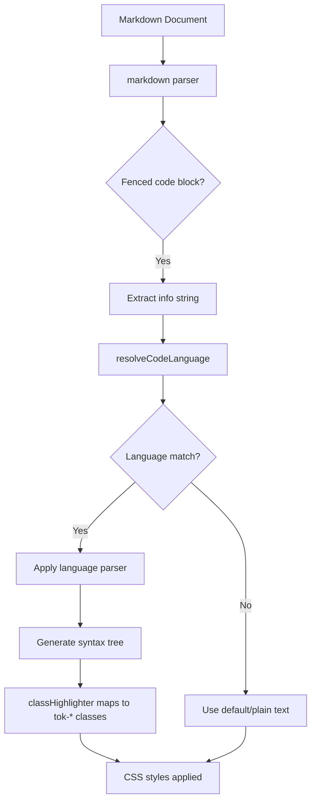

# Code Block Syntax Highlighting

## Status: ✅ Implemented

## Overview

Added syntax highlighting to fenced code blocks within markdown files using CodeMirror's language support system and `@lezer/highlight`. The implementation applies to both 'source' and 'live' modes.

## Supported Languages

| Language | Aliases |
|----------|---------|
| JavaScript | `javascript`, `js`, `jsx` |
| TypeScript | `typescript`, `ts`, `tsx` |
| Python | `python`, `py` |
| CSS | `css` |
| HTML | `html`, `htm` |
| JSON | `json` |

## Architecture



## Implementation Details

### Key Technical Insight

The critical implementation detail is using `classHighlighter` from `@lezer/highlight` instead of `defaultHighlightStyle` from `@codemirror/language`:

- **`classHighlighter`** produces `tok-*` CSS classes (e.g., `tok-keyword`, `tok-string`) that can be styled via CSS
- **`defaultHighlightStyle`** uses inline styles directly on elements, which cannot be customized via CSS classes

### Files Created/Modified

#### 1. [`webview/src/codeBlockHighlight.js`](webview/src/codeBlockHighlight.js) (new file)

Language resolver module that maps info strings to CodeMirror Language objects:

```javascript
import { javascript } from '@codemirror/lang-javascript';
import { python } from '@codemirror/lang-python';
import { css } from '@codemirror/lang-css';
import { html } from '@codemirror/lang-html';
import { json } from '@codemirror/lang-json';

// Language mapping - returns Language objects (not LanguageSupport)
const languageMap = {
  javascript: () => javascript().language,
  js: () => javascript().language,
  jsx: () => javascript({ jsx: true }).language,
  typescript: () => javascript({ typescript: true }).language,
  ts: () => javascript({ typescript: true }).language,
  tsx: () => javascript({ typescript: true, jsx: true }).language,
  python: () => python().language,
  py: () => python().language,
  css: () => css().language,
  html: () => html().language,
  htm: () => html().language,
  json: () => json().language
};

export function resolveCodeLanguage(info) {
  if (!info) return null;
  const normalized = info.toLowerCase().trim();
  const factory = languageMap[normalized];
  if (factory) return factory();
  return null;
}
```

**Important**: Language packages return `LanguageSupport` objects, but the `codeLanguages` option expects `Language` objects. Must return `.language` property.

#### 2. [`webview/src/editor.js`](webview/src/editor.js)

Added imports and updated `sourceMode()` function:

```javascript
import { classHighlighter, tags } from '@lezer/highlight';
import { resolveCodeLanguage } from './codeBlockHighlight';

function sourceMode() {
  return [
    markdown({
      base: markdownLanguage,
      addKeymap: false,
      codeLanguages: resolveCodeLanguage  // Enable code block parsing
    }),
    syntaxHighlighting(markdownHighlightStyle),
    syntaxHighlighting(classHighlighter),  // Maps tokens to tok-* classes
    sourceCodeBlockField
  ];
}
```

Also exports `classHighlighter` and `markdownHighlightStyle` for use in live mode.

#### 3. [`webview/src/liveDecorations.js`](webview/src/liveDecorations.js)

Updated `liveModeExtensions()` function:

```javascript
import { resolveCodeLanguage } from './codeBlockHighlight';
import { classHighlighter, markdownHighlightStyle } from './editor.js';

export function liveModeExtensions() {
  return [
    markdown({ base: markdownLanguage, addKeymap: false, codeLanguages: resolveCodeLanguage }),
    syntaxHighlighting(markdownHighlightStyle),
    syntaxHighlighting(classHighlighter),
    liveDecorationField
  ];
}
```

#### 4. [`webview/src/styles.css`](webview/src/styles.css)

Added CSS rules for `tok-*` classes using VS Code's semantic colors:

```css
/* Code block syntax highlighting - tok-* classes from classHighlighter */
.meo-src-code-block .tok-keyword,
.meo-md-code-block .tok-keyword { color: var(--vscode-symbolIcon-keywordForeground, #c586c0); }

.meo-src-code-block .tok-string,
.meo-md-code-block .tok-string { color: var(--vscode-debugConsole-infoForeground, #ce9178); }

.meo-src-code-block .tok-number,
.meo-md-code-block .tok-number { color: var(--vscode-debugTokenExpression-number, #b5cea8); }

.meo-src-code-block .tok-comment,
.meo-md-code-block .tok-comment { color: var(--vscode-editorGutter-commentRangeForeground, #6a9955); }

.meo-src-code-block .tok-function,
.meo-md-code-block .tok-function { color: var(--vscode-symbolIcon-functionForeground, #dcdcaa); }

.meo-src-code-block .tok-variableName,
.meo-md-code-block .tok-variableName { color: var(--vscode-symbolIcon-variableForeground, #9cdcfe); }

.meo-src-code-block .tok-typeName,
.meo-md-code-block .tok-typeName { color: var(--vscode-symbolIcon-typeParameterForeground, #4ec9b0); }

.meo-src-code-block .tok-operator,
.meo-md-code-block .tok-operator { color: var(--vscode-editor-foreground); }

.meo-src-code-block .tok-punctuation,
.meo-md-code-block .tok-punctuation { color: var(--vscode-editor-foreground); }

.meo-src-code-block .tok-propertyName,
.meo-md-code-block .tok-propertyName { color: var(--vscode-symbolIcon-propertyForeground, #9cdcfe); }

.meo-src-code-block .tok-atom,
.meo-md-code-block .tok-atom { color: var(--vscode-symbolIcon-enumMemberForeground, #569cd6); }
```

#### 5. [`webview/package.json`](webview/package.json) (dependencies)

Added language packages:
- `@codemirror/lang-javascript` - JavaScript & TypeScript
- `@codemirror/lang-python` - Python
- `@codemirror/lang-css` - CSS
- `@codemirror/lang-html` - HTML
- `@codemirror/lang-json` - JSON

## How It Works

1. The `markdown()` parser detects fenced code blocks with info strings (e.g., ` ```javascript `)
2. The `codeLanguages` option is called with the info string as argument
3. `resolveCodeLanguage()` returns the appropriate `Language` object
4. CodeMirror wraps the code content with that language parser
5. The parser generates syntax tree nodes with token types (keyword, string, etc.)
6. `classHighlighter` maps tokens to CSS classes (`tok-keyword`, `tok-string`, etc.)
7. CSS styles are applied to elements with those classes

## Bundle Size Impact

- `@codemirror/lang-javascript`: ~50KB
- `@codemirror/lang-python`: ~30KB
- `@codemirror/lang-css`: ~20KB
- `@codemirror/lang-html`: ~40KB
- `@codemirror/lang-json`: ~10KB

Total additional size: ~150KB (minified)

## Testing

To test, create a markdown file with fenced code blocks:

```javascript
const greeting = "Hello, World!";
console.log(greeting);
```

```python
def hello():
    print("Hello, World!")
```

```css
.container {
    display: flex;
    gap: 1rem;
}
```

Press F5 in VS Code to launch the extension development host and verify:
- [x] Syntax highlighting works in source mode
- [x] Syntax highlighting works in live mode
- [x] Mode switching preserves highlighting
- [x] Editing code blocks updates highlighting in real-time
- [x] Unknown languages fall back to plain text
